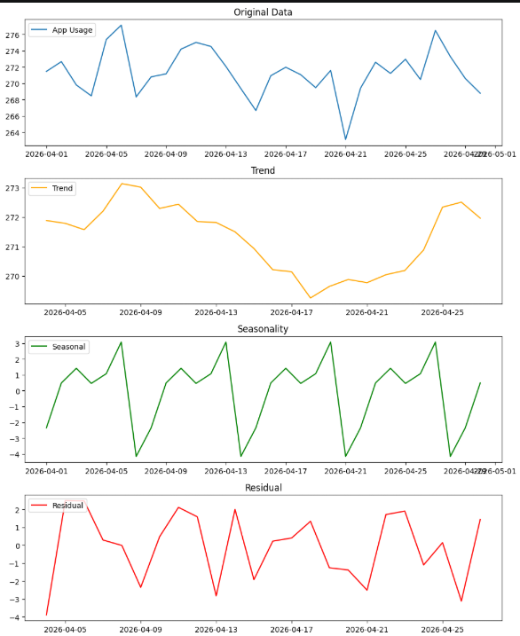

# Ex.No: 05  IMPLEMENTATION OF TIME SERIES ANALYSIS AND DECOMPOSITION
### Date: 02/05/2026


### AIM:
To Illustrates how to perform time series analysis and decomposition on the monthly average temperature of a city/country and for airline passengers.

### ALGORITHM:
1. Import the required packages like pandas and numpy
2. Read the data using the pandas
3. Perform the decomposition process for the required data.
4. Plot the data according to need, either seasonal_decomposition or trend plot.
5. Display the overall results.

### PROGRAM:

```py

import pandas as pd
import numpy as np
import matplotlib.pyplot as plt
from statsmodels.tsa.seasonal import seasonal_decompose


data = pd.read_csv("user_behavior_timeseries.csv")
data.columns = data.columns.str.strip()

# Convert Date column
data['Date'] = pd.to_datetime(data['Date'])

# Set index
data.set_index('Date', inplace=True)


data = data.groupby('Date').mean(numeric_only=True)

# Select column
col = "App Usage Time"

data[col] = data[col] + np.random.normal(0, 3, len(data))


decomposition = seasonal_decompose(data[col], model='additive', period=7)


plt.figure(figsize=(10,12))

# Original
plt.subplot(411)
plt.plot(data[col], label='App Usage')
plt.legend(loc='upper left')
plt.title('Original Data')

# Trend
plt.subplot(412)
plt.plot(decomposition.trend, label='Trend', color='orange')
plt.legend(loc='upper left')
plt.title('Trend')

# Seasonal
plt.subplot(413)
plt.plot(decomposition.seasonal, label='Seasonal', color='green')
plt.legend(loc='upper left')
plt.title('Seasonality')

# Residual
plt.subplot(414)
plt.plot(decomposition.resid, label='Residual', color='red')
plt.legend(loc='upper left')
plt.title('Residual')

plt.tight_layout()
plt.show()
```


### OUTPUT:



### RESULT:
Thus we have created the python code for the time series analysis and decomposition.
